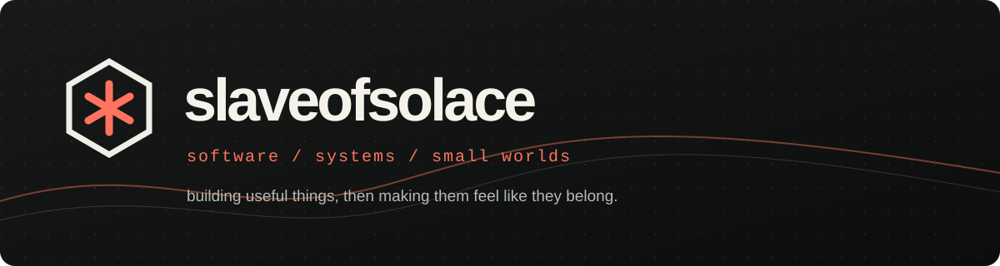

  

  <a href="https://slaveofsolace.com/">home</a>&nbsp;&nbsp;/&nbsp;&nbsp;
  <a href="https://slaveofsolace.com/work/">work</a>&nbsp;&nbsp;/&nbsp;&nbsp;
  <a href="https://slaveofsolace.com/work/projects/">projects</a>&nbsp;&nbsp;/&nbsp;&nbsp;
  <a href="https://slaveofsolace.com/work/blog/">blog</a>&nbsp;&nbsp;/&nbsp;&nbsp;
  <a href="https://slaveofsolace.com/work/contact/">contact</a>

I’m **sol**. I make browser tools, Windows software, small games, and the occasional project that refuses to fit a category.

### now

- co-building [nafs](https://nafs.fyi/) — a Muslim companion for prayer, Qur'an, dhikr, fasting, reflection, and journaling
- shipping [Insta Toolbox](https://github.com/slaveofsolace/Insta-Toolbox) — a local-first Instagram utility for Tampermonkey and the web
- continuing [My Bot 2.0](https://github.com/slaveofsolace/My-Bot-2.0) — a local control center around a long-running Clash of Clans automation project
- shaping [KYX.IO](https://slaveofsolace.com/work/projects/kyx-io/) — a browser arena FPS

### selected work

`01` [Insta Toolbox](https://github.com/slaveofsolace/Insta-Toolbox)  
`02` [My Bot 2.0](https://github.com/slaveofsolace/My-Bot-2.0)  
`03` [Solcord](https://github.com/slaveofsolace/Solcord)  
`04` [Soltex](https://github.com/slaveofsolace/soltex)

### workbench

JavaScript / TypeScript / Python / Java / Dart / HTML / CSS  
SvelteKit / Flutter / TensorFlow / Three.js / .NET / WPF  
VS Code / Claude Code / Codex / Figma / Inkscape / Blender

---

[visit the portfolio](https://slaveofsolace.com/) · [buy me a coffee](https://www.buymeacoffee.com/slaveofsolace) · [say hello](https://slaveofsolace.com/work/contact/)
